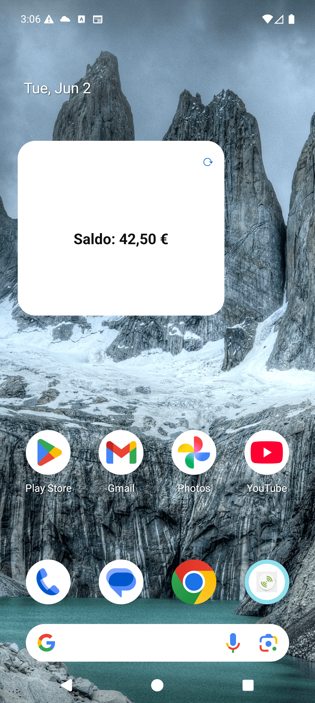

# Android validation log (Phase 2)

**Date:** 2026-06-02 · **Result:** ✅ Android path validated end-to-end on a real emulator.

The Jetpack Glance / Kotlin widget builds through Cordova and runs, with the app→widget
data push re-rendering the native UI.

## What was proven

| Capability | Status | Evidence |
|---|---|---|
| Glance/Compose/Kotlin compiles **through Cordova** (the central POC risk) | ✅ | `BUILD SUCCESSFUL`, `app-debug.apk` produced |
| Plugin wiring (Kotlin pref, Compose Gradle, manifest receiver, resources) | ✅ | verified in generated `platforms/android` project |
| Widget renders **logged-out** state (Kotlin UI, no layout XML) | ✅ | "Por favor faça login na App" on home screen |
| Cordova⇆Kotlin bridge | ✅ | `configure` + `writeData` round-trips returned success |
| **App→widget data push** updates the live widget | ✅ | `writeData({title:"Saldo: 42,50 €"})` → widget shows it ([screenshot](img/android-widget-logged-in.png)) |
| In-widget refresh button rendered + wired (`actionRunCallback`) | ✅ | ⟳ button visible; runs `RefreshAction` in background |
| Encrypted shared store survives across app/widget | ✅ | `EncryptedSharedPreferences` (`nos_widget_store.xml`) |



## Toolchain used (local)

- cordova **13.0.0**, cordova-android **13.0.0**
- **JDK 17** (Homebrew `openjdk@17`) — JDK 25 was present but Gradle rejects it
- Android **build-tools 34.0.0** + platform **android-34**
- Emulator: **Pixel 9 Pro, Android 16 (API 36)**

## Build issues found & fixes (reusable learnings)

1. **Bare `<preference>` in a plugin = required install variable.** Cordova read
   `GradlePluginKotlinEnabled` etc. as missing variables and failed install. Fix: inject
   them via `<config-file target="config.xml" parent="/*">`. (In OutSystems these come from
   the **Extensibility Configuration** instead — so the plugin doesn't hard-code them.)
2. **cordova-android 13 demands build-tools with the same major as compileSdk.** Only 36.1.0
   was installed; it refused it for compileSdk 34. Fix: install build-tools 34.0.0.
3. **`GlanceAppWidget.updateAll()` silently no-ops after (re)install.** It relies on Glance's
   provider→receiver mapping, which is empty until the receiver's `onUpdate` runs — so
   `updateAll` returned OK but never called `provideGlance`. **Fix:** `NosWidget.updateAllWidgets()`
   resolves `appWidgetId`s directly from `AppWidgetManager` and calls `update()` per id. This is
   the production-safe pattern and is now used by both the plugin and the refresh worker.

## Reproduce

```bash
# host app (simulates the OutSystems app + its Extensibility Configuration)
cordova create /tmp/noswidgethost com.nos.widgethost NosWidgetHost
cd /tmp/noswidgethost
cordova platform add android@13
cordova plugin add /path/to/os-cordova-plugin-nos-widgets
JAVA_HOME=$(/usr/libexec/java_home -v 17) ANDROID_HOME=~/Library/Android/sdk cordova build android
adb install -r platforms/android/app/build/outputs/apk/debug/app-debug.apk
# add the "NosWidgetHost" widget to the home screen, then open the app to push data
```

## Notes / follow-ups

- Debug `Log.d("NosWidget", …)` statements were added for diagnosis and left in (helpful for
  the POC). Gate behind `BuildConfig.DEBUG` before any production use.
- Deep-link target screen, real API endpoint, and the background-refresh cadence are still
  stubbed (POC uses an empty `apiBaseUrl`, so the worker re-renders without fetching).
- Not yet exercised on-device: the 30-min WorkManager periodic refresh and the widget→app
  event callback while the app is foregrounded.
