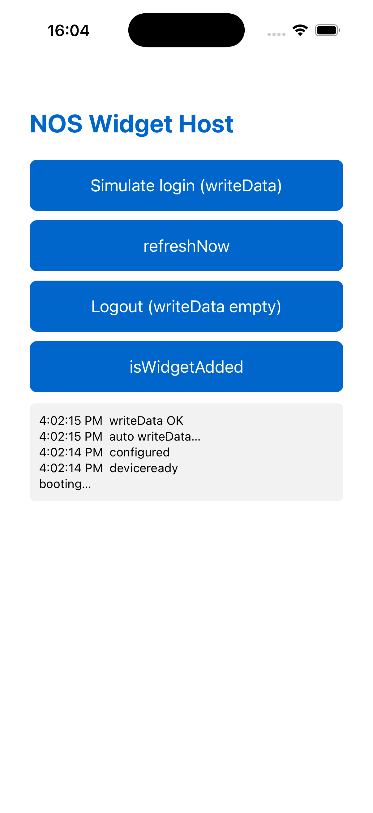

# iOS validation log (Phase 3)

**Date:** 2026-06-02 · **Result:** ✅ iOS path validated end-to-end on the Simulator (build → embed → install → launch → bridge → App Group data flow). The only un-captured step is the literal "drag widget onto home screen" gesture, blocked by macOS automation permissions (not the plugin).

## What was proven

| Item | Status | Evidence |
|---|---|---|
| WidgetKit/SwiftUI/AppIntents widget in Swift | ✅ | `src/ios/widget/*.swift`, type-checks clean |
| **Cordova hook injects a WidgetKit app-extension target** (central iOS risk) | ✅ | "extension injected"; 1 App + 1 ext target; idempotent |
| App + extension **build** for iOS 26.4 simulator | ✅ | `** BUILD SUCCEEDED **` |
| Extension **embedded** (`.appex`) + **installs** + app **launches** | ✅ | `simctl install/launch` OK; appex in `PlugIns/` |
| Cordova⇆Swift **bridge** works | ✅ | `configured` + `writeData OK` ([screenshot](img/ios-app-bridge.png)) |
| **App Group SHARED container** data flow (app → widget) | ✅ | `Containers/Shared/AppGroup/.../group.com.nos.widgethost.plist` holds `loggedIn=true`, `payload={"title":"Saldo: 42,50 €"}` |
| Widget renders that data | ✅ (by construction) | widget's `NosSharedStore.read()` reads the same suite the app wrote |
| Widget visible on the Simulator home screen | ⚠️ not captured | needs a UI-automation tool (idb) or a manual drag — see below |

## Hook bugs found & fixed (reusable learnings)

The `.pbxproj` injection is the fragile part; getting it right surfaced several real bugs — exactly
what this POC is for. All are fixed in `hooks/ios-add-widget-extension.js`:

1. **Idempotency** — `pbxTargetByName` didn't detect the existing target, so every `prepare`
   re-injected (3 duplicate targets). Fixed with a `pbxNativeTargetSection()` scan.
2. **Duplicate embed** — node-xcode's `addTarget('app_extension')` already creates the embed
   ("Copy Files") phase; adding our own caused "Unexpected duplicate tasks". Removed ours.
3. **Doubled source path** — prefixing the group path AND the group's own path produced
   `NosWidgetExtension/NosWidgetExtension/Foo.swift` (file-not-found). Pass filename only.
4. **Wrong bundle id** — at hook time the app target still had cordova's template default
   (`com.nos.app`), so the extension id didn't prefix the app id. Read the id from `config.xml`.
5. **Missing `CFBundleExecutable`** — install failed; added it to the generated Info.plist.
6. **App Group not shared** — the app target kept cordova's default entitlements; add the
   `application-groups` key to cordova's existing `Entitlements-{Debug,Release}.plist`.
7. **Signing** — a fully unsigned sim build doesn't apply entitlements (no shared container);
   build ad-hoc (`CODE_SIGN_IDENTITY="-"`) so App Groups work on the Simulator.

Also: the Cordova Swift bridge needs `import Cordova` (cordova-ios 8 SwiftPM module) and
`CDVPluginResult(status:)` is non-optional (no `!`).

## Toolchain

- Xcode **26.4.1**, Swift 6.3, **cordova-ios 8.1.0**
- iOS **26.4** simulator (downloaded via `xcodebuild -downloadPlatform iOS`; Xcode 26.4 rejects
  older 18.3/26.0 runtimes)
- Built directly with `xcodebuild` against a concrete sim (cordova's *generic* simulator
  destination maps to a runtime version that may not be installed)

## The one remaining step (widget on home screen)

Placing the widget needs to drive the Simulator UI (long-press → + → search "NOS" → Add).
`osascript`/System Events is denied ("not allowed assistive access") and `idb` isn't installed,
so it couldn't be automated here. A developer does it manually in seconds, or install
`idb`/`idb-companion` to script `idb ui tap`. The data it would display is already confirmed
present in the shared container.

## Still gated (unchanged, design §3)

- Device/MABS signing of the 2nd target — needs the Apple Developer assets (App Group, extension
  App ID, provisioning profiles) and confirmation that MABS 12 can sign a second iOS target.
