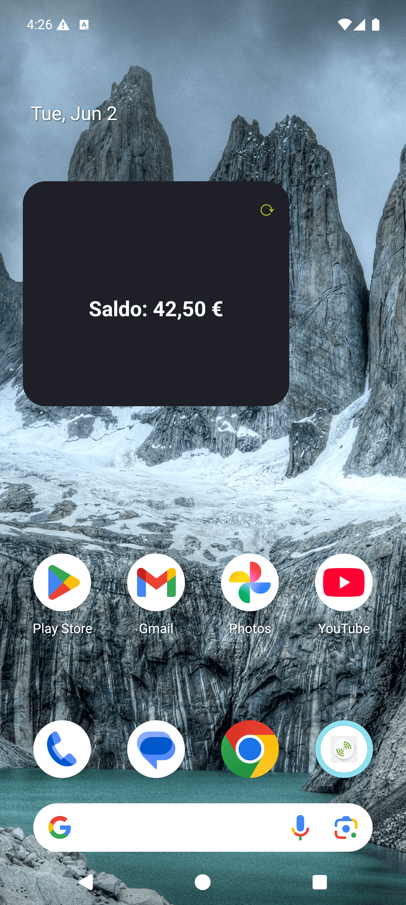
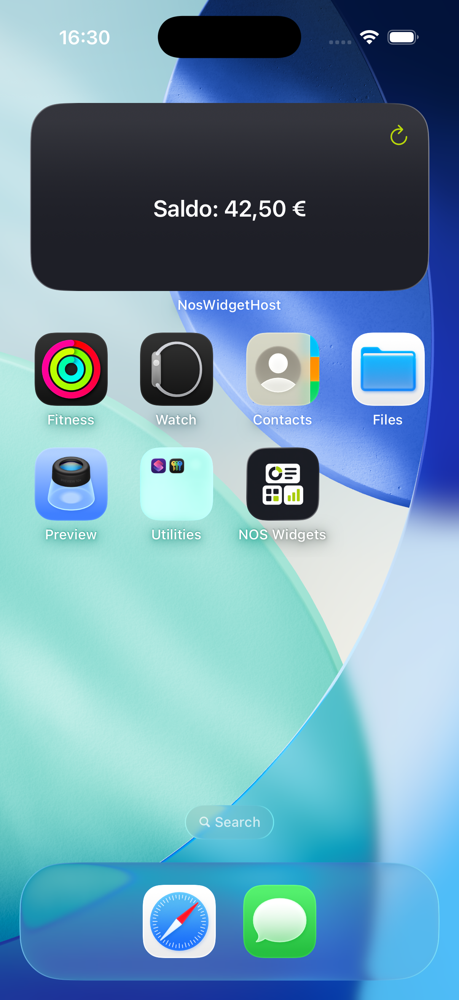

# NOS branding

The widget UI, the test app, and the icons follow the NOS visual identity (palette sampled from
nos.pt's CSS and the provided brand logos).

## Palette (from nos.pt)

| Token | Hex | Use |
|---|---|---|
| NOS dark | `#1E1F27` | widget background, app background |
| NOS dark 2 | `#2A2A33` | secondary surfaces / cards |
| NOS green | `#BAD80A` | accent (refresh action, primary buttons, headings) |
| White | `#FFFFFF` | primary text on dark |
| Muted grey | `#94959D` | secondary text |

## Brand assets (`/brand`)

| File | What |
|---|---|
| `nos-widgets-logo.png` | full "NOS WIDGETS" lockup |
| `nos-widgets-icon.png` | app icon (1254²) — source for all icon sizes |
| `app-icon-1024.png` | iOS marketing icon |
| `app-icon-foreground-432.png` | Android adaptive-icon foreground |

## Branded widget (both platforms)

Dark card, white balance, green refresh — identical on Android (Glance) and iOS (WidgetKit):

| Android | iOS |
|---|---|
|  |  |

## App icon (test app)

The Cordova default icon is replaced via `config.xml`:

```xml
<platform name="android">
  <!-- adaptive icon: foreground tiles on a solid NOS-dark background (one entry per density) -->
  <icon density="xxxhdpi" foreground="res/android/icon-foreground.png"
        background="res/android/icon-background.png" />
  <!-- ...mdpi/hdpi/xhdpi/xxhdpi... -->
</platform>
<platform name="ios">
  <icon src="res/ios/icon-1024.png" />
</platform>
```

Notes learned applying it:
- Android adaptive `<icon>` needs a **`density`** attribute (else cordova-android throws
  `Cannot read properties of undefined (reading 'startsWith')`).
- `background` must be an **image** (a solid `#1E1F27` PNG), not a hex string — cordova-android
  references `@mipmap/ic_launcher_background`, so a hex value fails AAPT resource linking.
- iOS accepts a single 1024² icon (`<icon src>`); cordova-ios 8 generates the asset catalog.

## Launch / splash screen

Both platforms show a NOS-dark launch screen.

**iOS** — full NOS WIDGETS logo centred on `#1E1F27`. Verified: the
`SplashScreenBackgroundColor.colorset` resolves to `0x1E/0x1F/0x27` and `LaunchStoryboard.imageset`
holds the logo. See [ios-launch-screen.png](img/ios-launch-screen.png).

```xml
<platform name="ios">
  <preference name="SplashScreenBackgroundColor" value="#1E1F27" />
  <!-- the logo is placed into App/Assets.xcassets/LaunchStoryboard.imageset -->
</platform>
```

**Android** — Android 12+ system splash: the brand mark on `#1E1F27`. It flashes briefly because
the WebView loads instantly, so it's hard to screenshot on this lightweight test app, but the
asset (`ic_cdv_splashscreen.png`) and background are generated from:

```xml
<platform name="android">
  <preference name="AndroidWindowSplashScreenBackground" value="#1E1F27" />
  <preference name="AndroidWindowSplashScreenAnimatedIcon" value="res/android/splash-icon.png" />
</platform>
```
