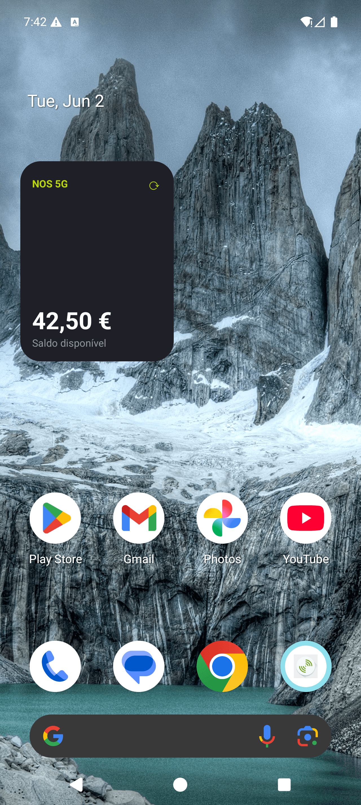
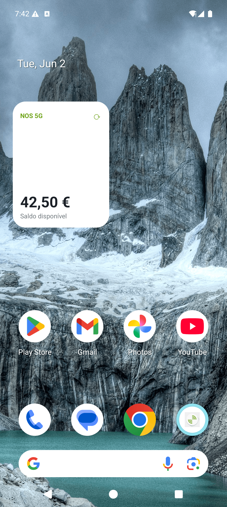
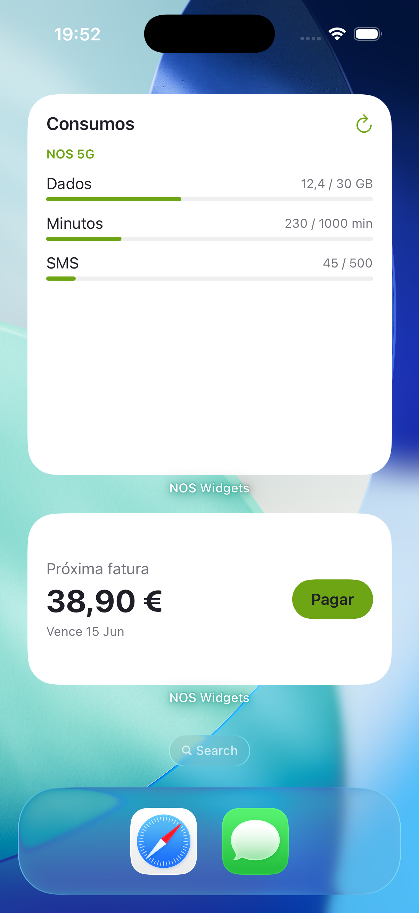
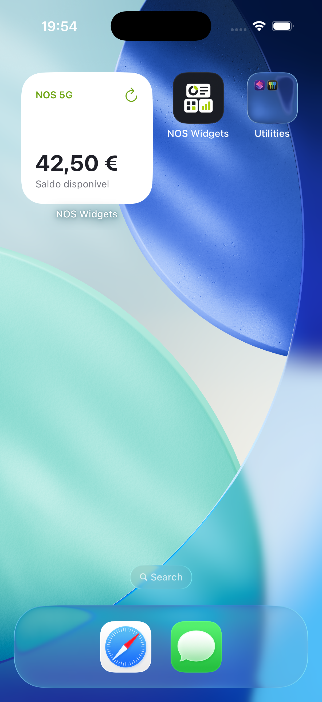
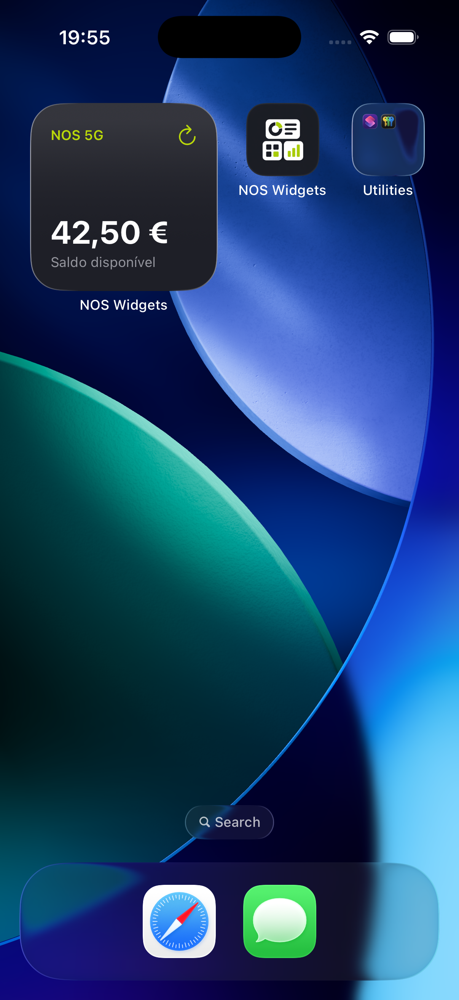

# Widgets & theming

## Three widgets (different shapes)

Realistic NOS self-care widgets, each a distinct size on both platforms:

| Widget | Shape | Android (Glance) | iOS (WidgetKit) | Content |
|---|---|---|---|---|
| **Saldo** | small / square | `2×1` | `.systemSmall` | prepaid balance + plan + refresh |
| **Fatura** | medium / wide | `4×1` | `.systemMedium` | next invoice + due date + **Pagar** action |
| **Consumos** | large | `4×2` | `.systemLarge` | Dados / Minutos / SMS usage bars |

All three were verified in the Android widget picker with the correct sizes, and Saldo was placed
live (see screenshots below). The iOS bundle ships all three families.

## Lock screen

- **iOS** — a dedicated **accessory** widget (`NosLockWidget`, iOS 16+) in the *same* WidgetKit
  extension (no extra target/signing): `.accessoryInline` (saldo above the clock), `.accessoryCircular`
  (a data-usage gauge), `.accessoryRectangular` (plan + saldo + data). The system renders accessory
  widgets monochrome/tinted, so NOS colours don't apply there. Validated on the iOS 26 simulator lock
  screen. Because accessory widgets need iOS 16, the extension's deployment floor is **iOS 16** and the
  widget is registered **unconditionally** — wrapping it in `if #available` inside the `WidgetBundle`
  fails to register it with the lock-screen gallery.
- **Android** — no code: every home-screen widget is lock-screen-eligible **by default** on Android 16
  QPR2+ (developers only *opt out* via `widgetCategory="not_keyguard"`, which we don't). So Saldo /
  Fatura / Consumos appear on the lock screen automatically on supporting devices, in full colour.

## System light / dark

Follows the OS automatically (palette from nos.pt):

| | Light | Dark |
|---|---|---|
| Background | `#FFFFFF` | `#1E1F27` |
| Text | `#1E1F27` | `#FFFFFF` |
| Green accent | `#6EA514` | `#BAD80A` |
| Track | `#DDDEE3` | `#404149` |

- **Android** — color resources with a `values-night/` override, referenced via
  `ColorProvider(resId)`. The RemoteViews resolves `@color/*` per the current configuration, so the
  widget switches **live** when the system theme changes (proven below — no re-render needed).
- **iOS** — `Color` backed by a dynamic `UIColor { traitCollection ... }`, so SwiftUI resolves the
  right variant per `userInterfaceStyle`.
- **Demo app** — CSS `prefers-color-scheme` (note: the Android System WebView force-dark behaviour
  can override this; the native widgets are the source of truth for theming).

Saldo widget, same device, system theme toggled:

| Android — dark | Android — light |
|---|---|
|  |  |

iOS — all three widgets placed (light), and Saldo toggled to dark live:

| iOS — Consumos + Fatura (light) | iOS — Saldo (light) | iOS — Saldo (dark) |
|---|---|---|
|  |  |  |

The iOS demo app follows the system too — [light](img/ios-app-light.png) / [dark](img/ios-app-dark.png)
(WKWebView honors `prefers-color-scheme`).

## Data model (pushed via `writeData`)

```json
{
  "plan": "NOS 5G",
  "balance": "42,50 €",
  "data":    { "used": 12.4, "total": 30, "unit": "GB" },
  "minutes": { "used": 230, "total": 1000 },
  "sms":     { "used": 45,  "total": 500 },
  "bill":    { "amount": "38,90 €", "due": "15 Jun" }
}
```

Each widget reads the fields it needs from the shared store; logged-out (empty token) shows the
"Please log in" state.

## Demo app (no rebuilds to change content)

`demo/index.html` (the Cordova host app's `www`) is data-driven: edit Plano / Saldo / Dados /
Minutos / SMS / Fatura in the form and hit **Atualizar widgets** → `writeData` pushes the new
payload and all placed widgets refresh. No rebuild needed to test different values.
